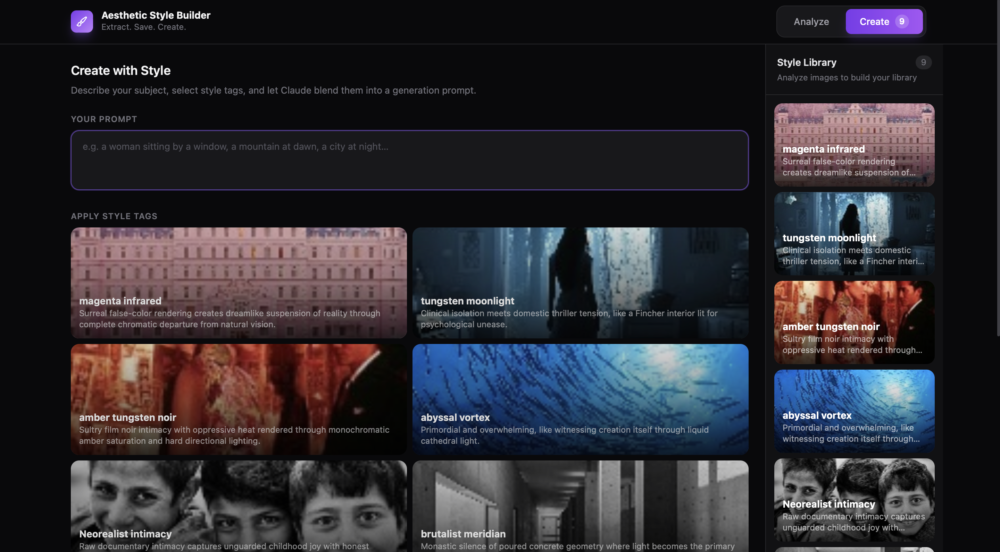
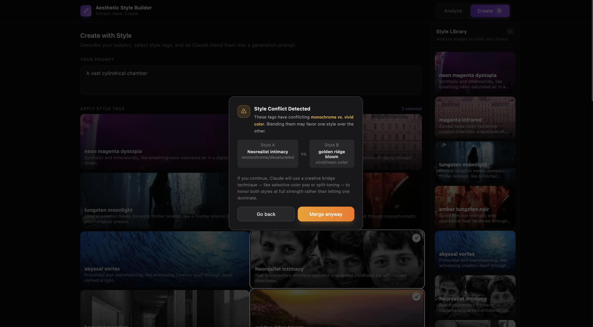
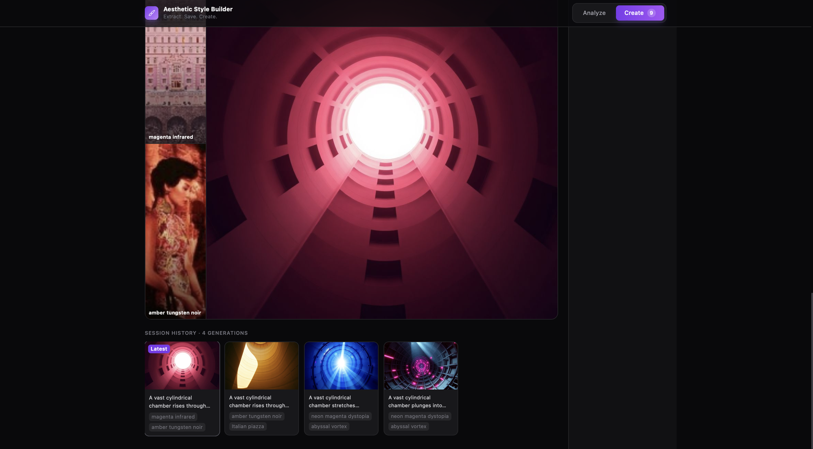

# Aesthetic Style Builder

> Extract the visual DNA of any image. Blend aesthetics. Generate with intention.

---

<!-- SCREENSHOT 1: Full app screenshot showing both panels side by side (Analyze mode on the left with a few style tags already saved, Create mode on the right with a generated image visible). Caption: "The full Aesthetic Style Builder interface." -->



---

## The Problem

AI image generation tools give you a text box and expect you to know what to write. The result is that most people default to vague style keywords — "cinematic", "moody", "vintage" — that mean nothing specific to a diffusion model. The generated image looks generic because the prompt was generic.

The deeper problem is that **aesthetic language is hard to articulate**. A cinematographer doesn't say "make it cinematic" — they specify the film stock, the lens aperture, the color temperature of the key light, the way shadows compress into the mids. That specificity is what creates a recognizable visual identity. Translating that specificity into a prompt that a model can act on is a craft in itself, and it's a craft most users don't have.

There's a second problem when you want to **combine multiple aesthetics**. Simply concatenating style keywords produces incoherent results — one style dominates and the others disappear. The model doesn't know how to arbitrate between a monochrome neorealist film grain and a neon cyberpunk color bleed. It picks one and ignores the other.

---

## The Approach

Aesthetic Style Builder solves this with a **two-stage AI pipeline** built around a core insight: the problem of style articulation can be separated from the problem of image generation.

**Stage 1 — Extraction:** Claude Vision analyzes any reference image and decomposes it into a structured aesthetic fingerprint across six orthogonal visual dimensions: color grading, lighting mood, texture quality, composition style, contrast level, and atmosphere. These become a saved **Style Tag** — a named, reusable aesthetic object.

**Stage 2 — Composition:** When generating, Claude Sonnet acts as a master prompt engineer and cinematographer. It receives the structured breakdowns of every selected Style Tag and is instructed to interleave their aesthetic dimensions into a single, 300–400 word cinematic brief — not a keyword list, but flowing descriptive prose that reads like a director's shot note. That brief is passed verbatim to FLUX.1-schnell for rendering.

The system also detects **aesthetic conflicts** — e.g. monochrome vs. vivid neon — and surfaces them to the user before generation, offering a creative bridge mode that synthesizes opposing treatments through techniques like split-toning or selective color pop rather than letting one style absorb the other.

---

## Architecture

```
┌─────────────────────────────────────────────────────────┐
│                        React Frontend                    │
│                                                         │
│   Analyze Mode                   Create Mode            │
│   ┌─────────────────┐            ┌──────────────────┐   │
│   │ Image Upload     │            │ Text Prompt      │   │
│   │ Style Tag Cards  │            │ Tag Selector     │   │
│   │ Save to Library  │            │ Conflict Modal   │   │
│   └────────┬────────┘            └────────┬─────────┘   │
│            │                              │              │
└────────────┼──────────────────────────────┼─────────────┘
             │                              │
             ▼                              ▼
┌─────────────────────────────────────────────────────────┐
│                    Express Proxy Server                  │
│                                                         │
│   POST /api/analyze          POST /api/compose          │
│   └─► Claude Vision           └─► Claude Sonnet         │
│       (Aesthetic extraction)      (Prompt composition)  │
│                                                         │
│                        POST /api/generate               │
│                        └─► FLUX.1-schnell               │
│                            (Image rendering)            │
└─────────────────────────────────────────────────────────┘
```

### Tech Stack

| Layer | Technology |
|---|---|
| Frontend | React 18, Vite, Tailwind CSS |
| Backend | Node.js, Express |
| Style Analysis | Claude claude-sonnet-4-20250514 (Vision) |
| Prompt Composition | Claude claude-sonnet-4-20250514 |
| Image Generation | FLUX.1-schnell via Together AI |

---

## Models

### Claude claude-sonnet-4-20250514 — Aesthetic Analysis

Used in the Analyze pipeline. Receives a base64-encoded image and returns a structured JSON object representing the image's aesthetic signature.

**Output schema:**
```json
{
  "tagName": "neon blade runner",
  "colorGrading": "electric cyan-magenta split with crushed blacks and saturated neon bleed",
  "lightingMood": "hard underlighting with practicals, rim-lit through rain-slicked surfaces",
  "textureQuality": "fine digital noise with halation bloom on light sources",
  "compositionStyle": "low angle with deep perspective and aggressive foreground compression",
  "contrastLevel": "extreme — near-black shadows with blown neon highlights",
  "atmosphere": "oppressive urban claustrophobia, rain-soaked, electric",
  "generationPrompt": "cyberpunk rain-soaked alley, neon reflections on wet pavement..."
}
```

### Claude claude-sonnet-4-20250514 — Prompt Composition

Used in the Create pipeline. Receives all selected Style Tags as structured data and composes a 300–400 word image generation prompt by treating each tag's aesthetic fields as dimensions to interleave, not summarize.

### FLUX.1-schnell — Image Rendering

Receives the composed prompt and renders a 1024×1024 image. The long-form cinematic prose produced by Claude maps naturally to FLUX's text encoder, which benefits from dense, specific descriptive language over keyword lists.

---

## Prompt Engineering

This is the technical core of the project.

### Extraction Prompt Strategy

The analysis system prompt instructs Claude to approach an image as a **cinematographer doing a technical breakdown**, not as a general image descriptor. Each field is defined with precision:

- **Color Grading** is asked for in terms of color science vocabulary: lift/gamma/gain manipulation, split-tone descriptions, specific color cast directions (e.g. "cyan in shadows, amber in mids")
- **Lighting Mood** is asked for in terms of source quality, direction, hardness, and practical vs. ambient ratio
- **Texture Quality** is asked for in terms of film grain characteristics, digital noise patterns, surface rendering
- **Composition Style** is asked for in terms of lens behavior, focal plane behavior, framing conventions
- **Atmosphere** is asked for as an emotional and environmental synthesis

The result is a tag that is **machine-readable as structured data** and **human-readable as a creative brief** simultaneously.

### Composition Prompt Strategy

The composition system prompt treats Claude as a **master prompt engineer with cinematographic fluency**. The key design decisions:

**Dimension-based interleaving mandate.** Claude is not told to "blend styles equally." It is told to treat each tag's fields as aesthetic dimensions and distribute them across the tags — pulling color grading from one source, composition from another, lighting from both — so that no single style absorbs the others.

**Prose mandate, not keyword lists.** The output must be 300–400 words of flowing, dense descriptive prose. This was a deliberate choice: FLUX performs better with rich, sentence-level descriptions than with comma-separated keyword lists, because sentence structure implies relationships between visual elements that keywords cannot.

**Specificity requirements.** The prompt explicitly bans vague language ("beautiful", "cinematic", "stunning") and requires concrete references: actual film stock names (Kodak Portra 400, Fuji Velvia 50, Ilford HP5), specific focal lengths and aperture rendering behavior, named color descriptions with tactile quality ("crushed olive", "amber tungsten", "electric cobalt").

**Conflict-aware synthesis.** When the user confirms a blend between aesthetically conflicting styles, a separate instruction mode activates. Claude is told that the standard blending logic is insufficient and must instead find a **creative visual language that honors both at full strength** — for example, a desaturated film base with selective neon color pop preserved on practical light sources, or a split-toning approach where shadows carry one style's palette and highlights carry the other's.

---

## Features

### Analyze Mode

<!-- SCREENSHOT 2: Analyze mode with an image just uploaded and the style tag form filled out, showing the 6 aesthetic fields populated by Claude. Caption: "Claude Vision decomposes a reference image into a structured aesthetic fingerprint." -->


- Upload any image (JPEG, PNG, WEBP)
- Claude Vision analyzes it into 6 structured aesthetic dimensions
- Save it as a named Style Tag to your library
- Tags persist in the session with their source thumbnail

### Create Mode

<!-- SCREENSHOT 3: Create mode with 2-3 tags selected, showing the blend preview (overlapping circle thumbnails) and a long composed prompt in the "Composed Prompt" card. Caption: "Multi-style blending: Claude composes a 300-400 word cinematic brief from multiple Style Tags." -->


- Write a subject/scene concept in plain language
- Select one or more Style Tags from your library
- Two-step pipeline visualization: Claude composing → FLUX rendering
- Composed prompt is shown in full and copyable
- Download the generated image

### Style Conflict Detection

<!-- SCREENSHOT 4: The conflict detection modal, showing the amber warning popup with Style A vs Style B comparison, the conflict reason highlighted in amber text, and the "Merge anyway" button. Caption: "The conflict detection system surfaces aesthetic incompatibilities before generation." -->



When two selected tags carry visually incompatible aesthetics — monochrome vs. vivid color, high-key vs. low-key — the system detects this before calling any API and presents the user with a choice:

- **Go back** — deselect one of the conflicting tags
- **Merge anyway** — Claude switches to conflict-bridge mode and synthesizes a creative resolution

Conflict detection runs entirely on the frontend using keyword analysis of each tag's `colorGrading`, `generationPrompt`, and `atmosphere` fields against a taxonomy of known visual incompatibilities.

### Session History

<!-- SCREENSHOT 5: The session history strip at the bottom of the Create panel, showing 4-5 thumbnail cards with their tags labeled. Caption: "Every generation is saved to session history with its prompt and source tags for one-click restore." -->



Every generation is stored in session history with its composed prompt, source tags, and thumbnail. Clicking any history card fully restores the session state — prompt, selected tags, and image.

---

## Setup

### Prerequisites

- Node.js 18+
- Anthropic API key
- Together AI API key

### Install

```bash
git clone https://github.com/your-username/aesthetic-style-builder
cd aesthetic-style-builder
npm install
```

### Configure

Create a `.env` file at the root:

```env
VITE_ANTHROPIC_KEY=your_anthropic_api_key
VITE_TOGETHER_KEY=your_together_ai_api_key
```

### Run

```bash
# Start the Express proxy server
node server.js

# In a separate terminal, start the Vite dev server
npm run dev
```

Open `http://localhost:5173`.

---

## Project Structure

```
├── server.js                  # Express proxy — /api/analyze, /api/compose, /api/generate
├── src/
│   ├── App.jsx                # Root — mode routing, tag library state
│   ├── components/
│   │   ├── AnalyzePanel.jsx   # Image upload + style extraction UI
│   │   ├── CreatePanel.jsx    # Tag selection, generation, conflict modal, history
│   │   ├── StyleTag.jsx       # Reusable tag card component
│   │   └── ModeToggle.jsx     # Analyze / Create switcher with tag count badge
│   ├── hooks/
│   │   └── useCreate.js       # All Create mode state and logic
│   ├── api/
│   │   ├── claude.js          # composePrompt(), analyzeImage()
│   │   └── together.js        # generateImage()
│   ├── utils/
│   │   └── detectStyleConflict.js  # Frontend conflict taxonomy and detection
│   └── constants/
│       └── models.js          # API endpoint constants
```

---

## Design Philosophy

The visual interface is intentionally dark and minimal — zinc-900 backgrounds, subtle borders, violet accent for AI actions, amber for warnings. The UI should recede so the generated images and style thumbnails are the primary visual content. 

---

## Built at AI Builders Hackathon — March 2026
